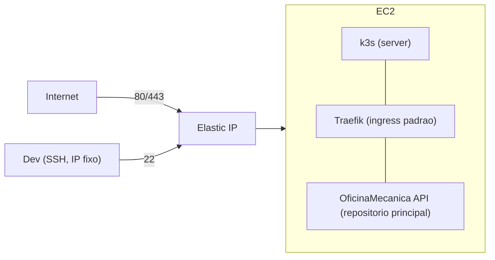

# oficina-mecanica-infra-k8s

Infraestrutura como código (Terraform) do cluster Kubernetes do projeto **OficinaMecanica** — Fase 3 do Tech Challenge (POS TECH/FIAP).

Cria uma instância EC2 rodando **k3s** (Kubernetes leve, auto-gerenciado) em vez de EKS — EKS não tem free tier (cobra por hora mesmo ocioso); ver ADR 0001 em `OficinaMecanica/docs/`.

## O que este repositório cria

- 1 EC2 `t3.micro` na subnet pública do repositório `oficina-mecanica-infra-db` (localizada via `data source` por tag, sem remote state)
- k3s instalado via `user_data` no boot (inclui Traefik como ingress controller e ServiceLB, dispensando um Load Balancer gerenciado)
- 1 Elastic IP associado à instância
- Security Group: porta 22 (SSH) restrita a um único IP, portas 80/443 abertas (tráfego da aplicação via Traefik), porta 6443 (API do Kubernetes) **fechada para a internet** — deploys são feitos via SSH, não `kubectl` remoto direto (ver ADR correspondente)
- Par de chaves SSH dedicado (`k3s_ec2_key` / `k3s_ec2_key.pub`) — a chave privada não é versionada



## Como rodar localmente

Pré-requisitos: Terraform >= 1.6, credenciais AWS válidas (AWS Academy Learner Lab).

```bash
terraform init
terraform plan
terraform apply
```

## CI/CD

Workflow em `.github/workflows/terraform.yml`: `terraform plan` comentado em Pull Requests para `main`; `terraform apply -auto-approve` no merge em `main`.

Secrets necessários: `AWS_ACCESS_KEY_ID`, `AWS_SECRET_ACCESS_KEY`, `AWS_SESSION_TOKEN` (mesma observação do repositório `oficina-mecanica-infra-db` sobre a rotatividade de credenciais do AWS Academy Learner Lab).

## State remoto

State em S3 (`oficina-mecanica-tfstate-159157616728`, key `k8s/terraform.tfstate`), mesmo bucket compartilhado com os demais repositórios Terraform do projeto.
